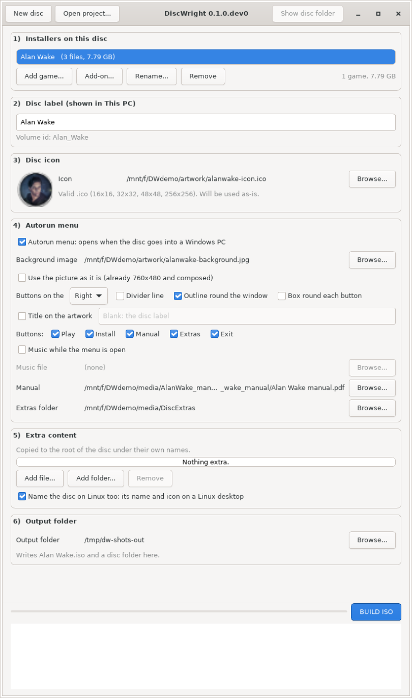

# DiscWright for Linux

Turn a GOG offline installer into a real game disc, on Linux: the game's own icon
and title when the disc goes into a Windows PC, a menu on double-click, and the
game's name and icon on a Linux desktop.

This is the Linux version of [DiscWright](https://github.com/lazardjokovic/discwright),
which does the same on Windows. It builds **the same disc**, so a disc made on
either machine works on both.

## Status

**Works, and not released yet.** Everything the Windows app does to make a disc is
here, from the command line or a window:

- reading a GOG download folder: the installer, its parts, and the game's name
- add-ons: DLC, expansions, GOG patches and mods, filed under their game
- the disc label, `autorun.inf`, and the files that name the disc on Linux
- the disc icon from any picture
- the menu and its background: the same menu Windows puts on the disc, byte for byte
- the ISO, written with xorriso, which Windows reads as the same disc
- the project file a disc is saved as, shared with the Windows app

A whole disc has been built and compared with one Windows built from the same
settings: same label, same name in Explorer, ten of its twelve files byte for byte
and the other two the same pictures. See [docs/xorriso-spike.md](docs/xorriso-spike.md).

Needs Python 3.10 or newer, Pillow, and xorriso (`sudo apt install xorriso`). The
window needs GTK 4 as well.

## The window

```sh
discwright window
```

The same six numbered steps as the Windows app: the installers, the label, the
icon, the menu, the extra content, the output folder. Anything that cannot be used
yet is greyed out, and hovering it says why; **BUILD ISO** says the first thing
still missing.



It needs GTK 4 and PyGObject:

```sh
sudo apt install gir1.2-gtk-4.0 python3-gi      # Debian, Ubuntu
sudo dnf install gtk4 python3-gobject           # Fedora
```

## Building a disc from the command line

```sh
discwright build --game ~/GOG/Alan_Wake \
                 --icon ~/art/alanwake.ico \
                 --background ~/art/alanwake.jpg \
                 --label "ALAN WAKE" \
                 --manual ~/media/manual.pdf \
                 --out ~/discs/alanwake
```

That writes `~/discs/alanwake/ALAN WAKE.iso`, and the disc folder beside it. A
disc can hold several games, and an add-on belongs to the game named before it:

```sh
discwright build --game ~/GOG/Witcher --add-on ~/GOG/Witcher/patch_1.4_to_1.5.exe \
                 --game ~/GOG/Witcher2 --icon ~/art/witcher.png \
                 --background ~/art/witcher.jpg --out ~/discs/witcher
```

`discwright build --help` lists the rest: which buttons the menu has, which side
they sit on, music, extra content, and `--stage-only` to lay the disc out as a
folder without writing an ISO.

Every build saves a `discproject.json` beside the ISO, and that file rebuilds the
disc:

```sh
discwright build --project ~/discs/alanwake/discproject.json
```

It is the same file the Windows app writes, so a disc saved on either machine
opens on the other.

## Developing

```sh
python3 -m venv ~/.venvs/discwright
~/.venvs/discwright/bin/pip install -e ".[dev,gui]"
~/.venvs/discwright/bin/python -m pytest
```

Installing the `gui` extra builds PyGObject, which needs
`libgirepository-2.0-dev libcairo2-dev pkg-config python3-dev`. The window's tests
skip without GTK 4 or a display; under `xvfb-run` they run without one, which is
how CI runs them.

## License

MIT
